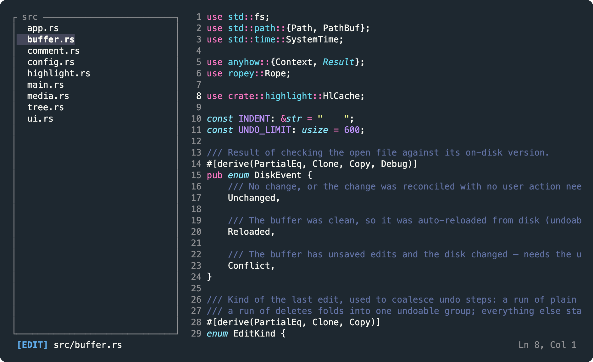
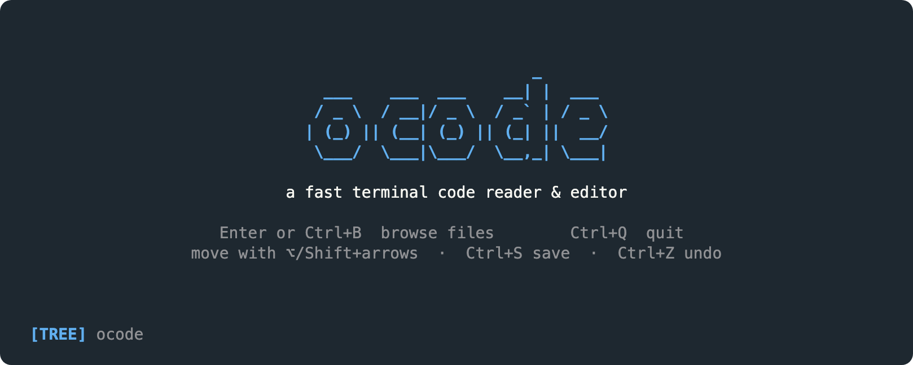

<h1 align="center">opencode</h1>

<p align="center">
  <b><code>ocode</code></b> — read and edit code in your terminal, fast.
</p>

<p align="center">
  
</p>

opencode opens a file or a folder and renders it instantly: syntax-highlighted
code, a file tree, smooth scrolling, selection and clipboard. The whole screen
is your code — the only chrome is a single status line at the bottom.

## Features

- **Smooth on big files** — a rope buffer with incremental highlighting; it
  idles at 0% CPU while you read.
- **Selection & clipboard** — `Shift`-select, then copy / cut / paste through
  your **system clipboard** (paste into any other app), or type over a
  selection to replace it.
- **Real undo/redo** — word-granular; "unsaved" means the text actually differs
  from disk, so undoing back to the saved content is treated as clean.
- **15 color schemes + your own** — live preview, your choice is saved, and a
  scheme only recolors *code* so your terminal background stays untouched.
- **79 languages** — including TOML, `.env`, INI and Dockerfile; drop in any
  Sublime grammar to add more.
- **One keymap for macOS & PC** — auto-detected, no `Cmd` needed, works in any
  terminal — even a MacBook without Home/End keys.

## Install

```sh
git clone https://github.com/wstran/opencode
cd opencode
cargo build --release
cp target/release/ocode /usr/local/bin/   # or anywhere on your $PATH
```

Needs **Rust 1.85+** (edition 2024). Pure-Rust dependencies — no C compiler
required.

## Usage

```sh
ocode               # browse the current directory
ocode src/main.rs   # open a single file straight into the editor
ocode ./project     # open a directory with the file tree focused
ocode --style       # (or -s) re-open the style picker and save a new scheme
```

On first launch a **style picker** appears (live preview, `↑/↓` to choose,
`Enter` to apply). Your pick is saved to `~/.config/opencode/config`, so every
later launch goes straight to the editor.

<p align="center">
  
</p>

## Keybindings

Everything is on **`Ctrl`** (macOS terminals never deliver `Cmd` to an app, so
`Cmd` is not used — `Ctrl` works identically on both platforms). The one key
that adapts to the OS is the **navigation modifier**, written `nav` below:
**`Option` (`⌥`) on macOS, `Ctrl` on Windows/Linux**.

### Commands

| Key                            | Action                                          |
|--------------------------------|-------------------------------------------------|
| `Ctrl+S`                       | Save (flashes a green ✓ Saved)                  |
| `Ctrl+A`                       | Select all                                      |
| `Ctrl+C` / `Ctrl+X` / `Ctrl+V` | Copy / cut / paste the selection                |
| `Ctrl+Z` / `Ctrl+Y`            | Undo / redo (`Ctrl+Shift+Z` also redoes)        |
| `Ctrl+F`                       | Search in the current file                      |
| `Ctrl+B`                       | File browser: open & focus → back to it → hide  |
| `Ctrl+Q`                       | Quit (press twice if there are unsaved changes) |

Every `Ctrl`-letter is a **command** (above); cursor motion and editing live on
the **dedicated keys** below — one consistent rule.

### Move & select

`Shift` turns any motion into a **selection**; the same motion without `Shift`
moves the cursor and clears the selection. `nav` makes the step bigger.

| Motion                | Key                | + `Shift` selects |
|-----------------------|--------------------|-------------------|
| Left / right          | `←` / `→`            | by character      |
| By word               | `nav + ←/→`          | by word           |
| Up / down             | `↑` / `↓`            | by line           |
| By block (blank line) | `nav + ↑/↓`          | by block          |
| Line start / end      | `Home` / `End`      | to line edge      |
| File start / end      | `Ctrl+Home` / `Ctrl+End` | to file edge |
| Scroll a screen       | `PageUp` / `PageDown` | a screen         |

### Edit

| Key                    | Action                                       |
|------------------------|----------------------------------------------|
| any character / paste  | Insert — **replaces the selection** if any   |
| `Enter`                | New line (keeps the current indent)          |
| `Backspace`            | Delete left, or the selection                |
| `Delete`               | Delete right, or the selection               |
| `nav + Backspace`      | Delete the previous word                     |
| `Tab` / `Shift+Tab`    | Indent / outdent the current line            |

### File tree (when focused)

| Key                | Action                              |
|--------------------|-------------------------------------|
| `↑` / `↓`          | Move selection                      |
| `→` / `←`          | Expand / collapse a directory       |
| `Enter` / `Space`  | Open a file / toggle a directory    |
| `Tab`              | Jump to the editor                  |

`Ctrl+B` cycles: editor → open & focus the list → back to the list → hidden.
Switching files with unsaved edits warns first (`Ctrl+S` to save, or confirm
again to discard).

> **MacBook (no Home/End/PageUp keys):** use `Fn + ←/→` for line start/end,
> `Fn + ↑/↓` to scroll, `Fn + Delete` for forward-delete. Or skip `Fn` entirely:
> `nav + ↑/↓` jumps to the file's top/bottom, and word/block motions are all on
> `Option + arrows`.

## Styles

A style only recolors your **code** — opencode never paints a background, so
your terminal's own background (and transparency) is preserved. The picker tags
each scheme `dark` / `light` so you can match your terminal.

**15 built in:** seven from syntect (`base16-*`, `Solarized`, `InspiredGitHub`)
plus **Dracula, One Dark, One Half Dark/Light, Coldark Dark/Cold, Sublime
Snazzy, Two Dark**. Add your own by dropping a `.tmTheme` into
`~/.config/opencode/themes/`.

## Languages

Syntax highlighting covers **79 languages** (syntect's 75 defaults plus bundled
TOML, `.env`, INI and Dockerfile). Add any `.sublime-syntax` grammar in
`~/.config/opencode/syntaxes/` to support more. Print the full list with
`cargo run --example catalog`.

## Performance

- **rope buffer** (`ropey`) — large files edit in O(log n), not O(n).
- **incremental highlighting** — only visible lines are highlighted, resuming
  from a cached parser checkpoint; an edit re-highlights from that line down.
- **input-driven loop** — redraws on keypress, so it sits at 0% CPU while idle;
  the only timed wake-up fades the save flash.
- **O(1) undo snapshots** — cheap rope clones, grouped at word boundaries.

## Project layout

```
src/main.rs        CLI, terminal setup/teardown, event loop
src/app.rs         application state and key handling
src/buffer.rs      rope buffer: cursor, selection, edits, undo, search
src/tree.rs        lazy file-tree model
src/highlight.rs   syntect integration + incremental highlight cache
src/config.rs      saved style + user theme/grammar folders
src/ui.rs          rendering (welcome, picker, tree, editor, status)
assets/            bundled themes (.tmTheme) and grammars (.sublime-syntax)
```

`cargo test` runs the suite; `cargo run --example catalog` lists themes and
languages.

## Contributing

Issues and pull requests welcome. Keep changes focused, run `cargo build` and
`cargo test` before opening a PR, and match the existing style.

## License

[MIT](LICENSE). Bundled themes and grammars are MIT by their respective authors —
see `assets/themes/NOTICE` and `assets/syntaxes/NOTICE`.

Built with [ratatui](https://github.com/ratatui/ratatui),
[crossterm](https://github.com/crossterm-rs/crossterm),
[ropey](https://github.com/cessen/ropey),
[syntect](https://github.com/trishume/syntect) and
[arboard](https://github.com/1Password/arboard).
